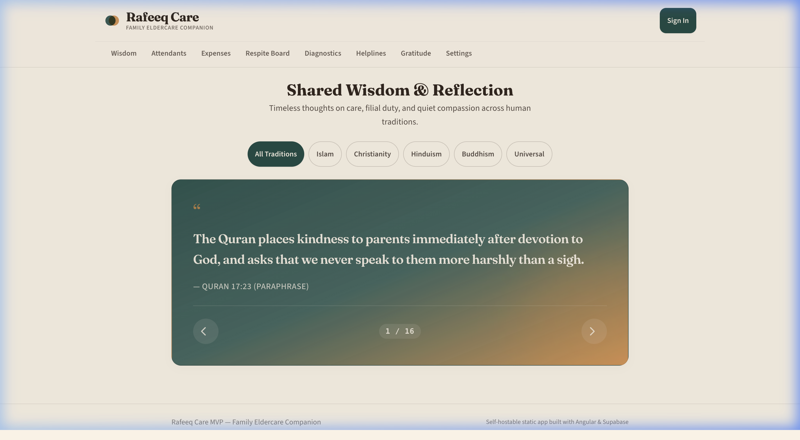
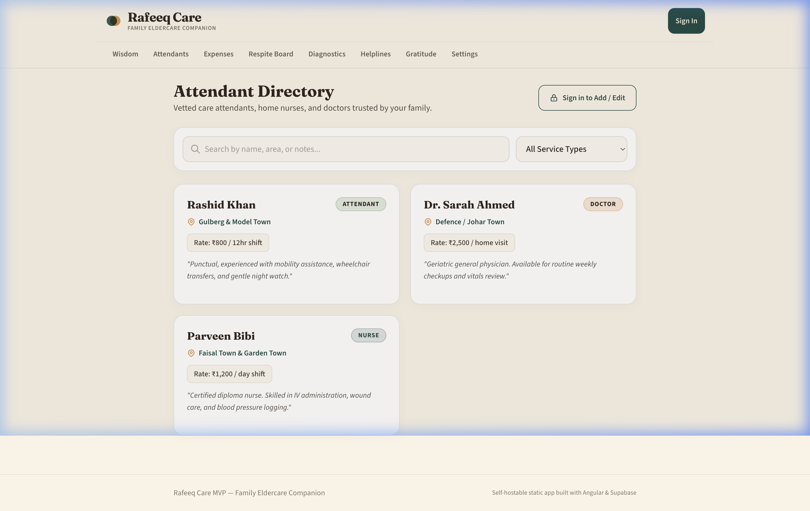
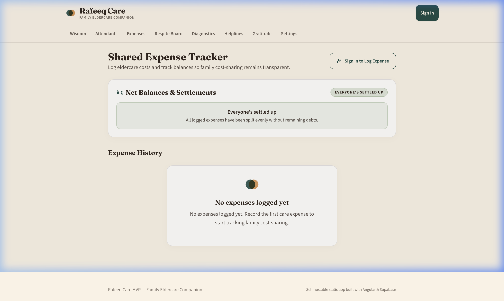
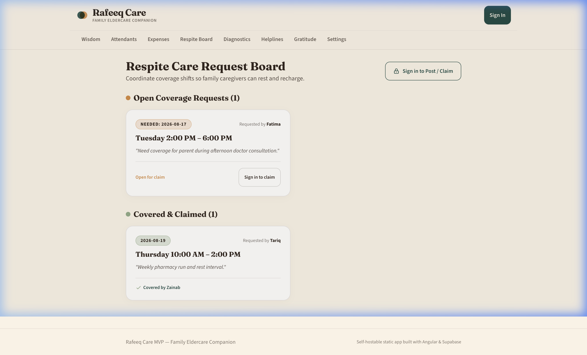
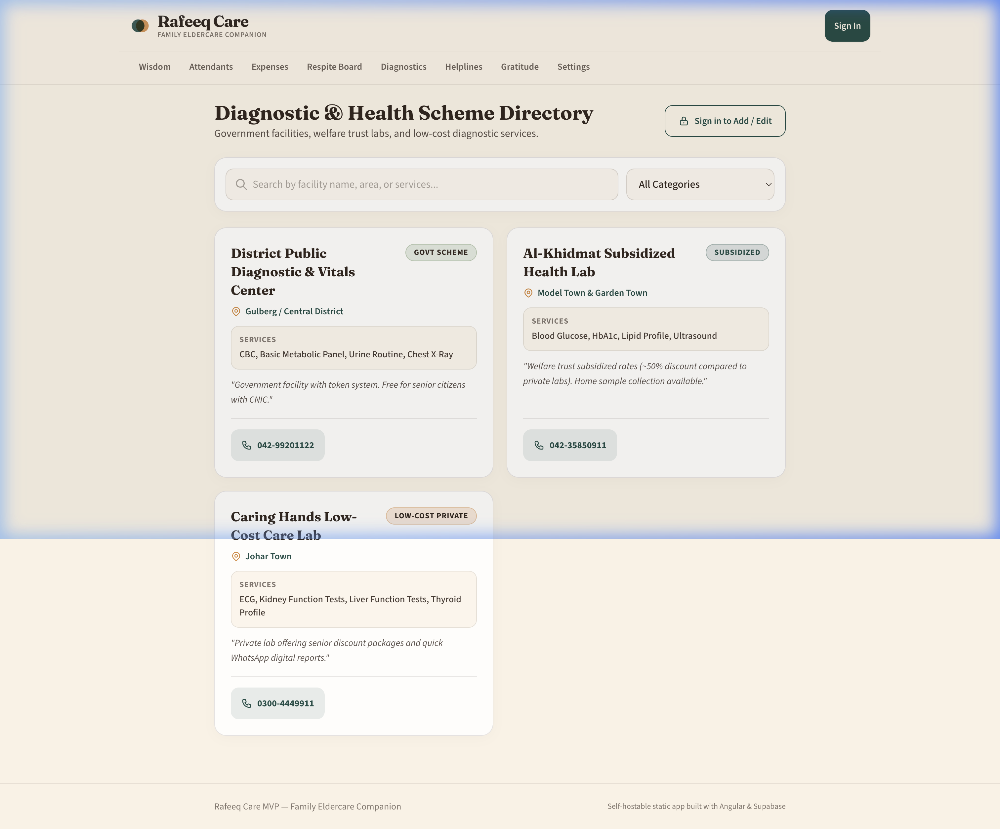
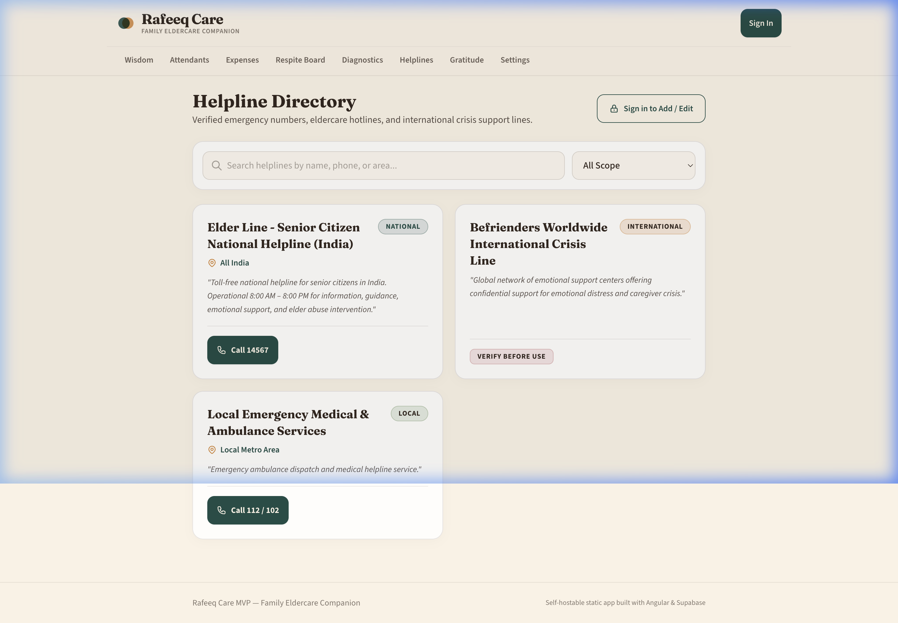
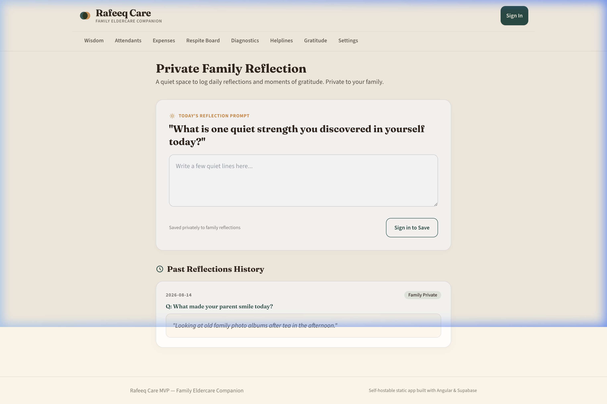
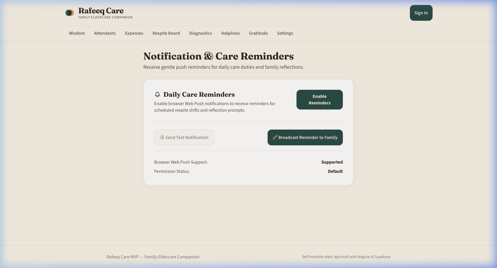

# Rafeeq Care (رفيق) — Family Eldercare Companion MVP

**Open-source eldercare coordination app — attendant directory, shared expense tracker, respite coverage board, low-cost diagnostic search, helplines, & daily reflection journal. Angular 18+ & Supabase, self-hostable static app on GitHub Pages.**

> A companion, not a diagnosis. Rafeeq Care is a small, free, open-source tool that helps families coordinate home-visit care attendants, split care-related expenses, manage shift coverage, and support caregiver emotional well-being — built out of one family's experience caring for a parent through late-stage illness.

---

## 📸 Feature Screenshots Gallery

| **Shared Wisdom Carousel** | **Attendant Directory** |
| :---: | :---: |
|  |  |

| **Shared Expenses & Net Balances** | **Respite Care Board** |
| :---: | :---: |
|  |  |

| **Low-Cost Diagnostic Search** | **Helpline Directory** |
| :---: | :---: |
|  |  |

| **Private Gratitude Journal** | **Notifications & Web Push** |
| :---: | :---: |
|  |  |

---

## 🌟 Key Application Features

1. **📖 Shared Wisdom Carousel (`/#/wisdom`)**: Paraphrased reflection quotes across 5 human traditions (Islam, Christianity, Hinduism, Buddhism, Universal) with 7s autoplay, pause on hover/touch, and category chips.
2. **👥 Attendant Directory (`/#/attendants`)**: Directory of vetted nurses, doctors, and home-visit attendants filterable by service type and area.
3. **💰 Shared Expense Tracker (`/#/expenses`)**: Log care expenses with real-time automated arithmetic computing net balances ("who owes whom").
4. **🤝 Respite Care Request Board (`/#/respite`)**: Coverage request board displaying open shifts first with a one-tap "Claim this" action, and claimed shifts below.
5. **🏥 Low-Cost Diagnostic Directory (`/#/diagnostics`)**: Government, subsidized, and low-cost diagnostic center listings filterable by category and search.
6. **📞 Helpline Directory (`/#/helplines`)**: Emergency contacts and hotlines filterable by scope (`national` | `international` | `local`), seeded with India Elder Line (`14567`) and crisis support lines.
7. **✍️ Private Gratitude Reflection (`/#/gratitude`)**: Private family journal cycling 6 rotating daily prompts with date-based reflection history.
8. **🔔 Web Push Notifications & Settings (`/#/settings`)**: Enable Web Push notifications backed by `public/sw.js` and Supabase Edge Function `send-reminder`.

---

## 🏗️ System Architecture & Documentation

For detailed system diagrams, sequence flows, and technical design notes, view:
👉 **[System Architecture & Design Document (docs/ARCHITECTURE.md)](./docs/ARCHITECTURE.md)**

---

## 🚀 Use It Yourself (Fork & Run)

Designed so any family can fork it and run their own private copy in under 15 minutes on their free Supabase project.

### 1. Fork & clone repo
```bash
git clone https://github.com/<your-username>/Rafeeq-Elder-Care.git
cd Rafeeq-Elder-Care
npm install
```

### 2. Create your free Supabase project
1. Go to [supabase.com](https://supabase.com) → Create a new project (free tier).
2. In the **SQL Editor**, run the schema scripts:
   - `supabase-schema.sql` (v0.1)
   - `supabase-schema-v0.2.sql` (v0.2)
   - `supabase-schema-v0.3.sql` (v0.3)
3. Copy your Project URL and anon public key from Settings → API.

### 3. Configure environment
Edit `src/environments/environment.ts` (and `src/environments/environment.prod.ts`):
```typescript
export const environment = {
  production: false,
  supabaseUrl: 'https://your-project.supabase.co',
  supabaseAnonKey: 'your-anon-public-key',
  vapidPublicKey: 'your-vapid-public-key'
};
```

### 4. Run locally
```bash
npx ng serve
```
Visit `http://localhost:4200`.

---

## 🌐 Deploy to GitHub Pages

Build and publish this static Angular app directly to GitHub Pages:

```bash
# 1. Build production static bundle with your repository base-href
npx ng build --base-href "/Rafeeq-Elder-Care/"

# 2. Deploy to gh-pages branch
npx angular-cli-ghpages --dir=dist/rafeeq-care-mvp/browser
```

---

## 📁 Project Documentation

- **[docs/ARCHITECTURE.md](./docs/ARCHITECTURE.md)** — System architecture, Mermaid flowcharts, and screenshots gallery
- **[AGENTS.md](./AGENTS.md)** — Core guardrails and instructions for AI agents
- **[CONTRIBUTING.md](./CONTRIBUTING.md)** — Contribution guidelines
- **[LEGAL.md](./LEGAL.md)** — Disclaimers and non-medical privacy directives
- **[LICENSE.md](./LICENSE.md)** — MIT License

---

## 💚 Why "Rafeeq"?

رفيق (*Rafeeq*) means companion — someone who walks with you gently through a hard journey. That's the intent here: a small, dignified companion tool for families.