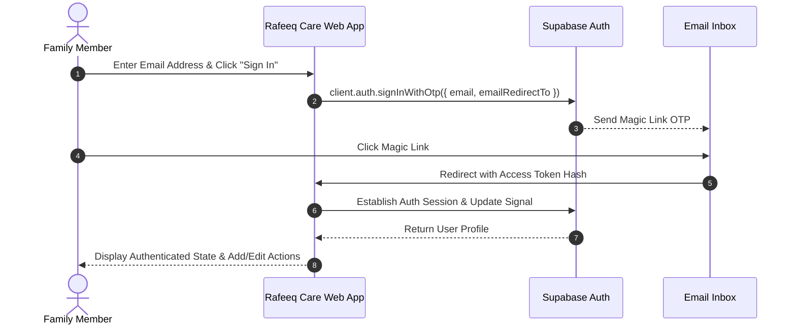
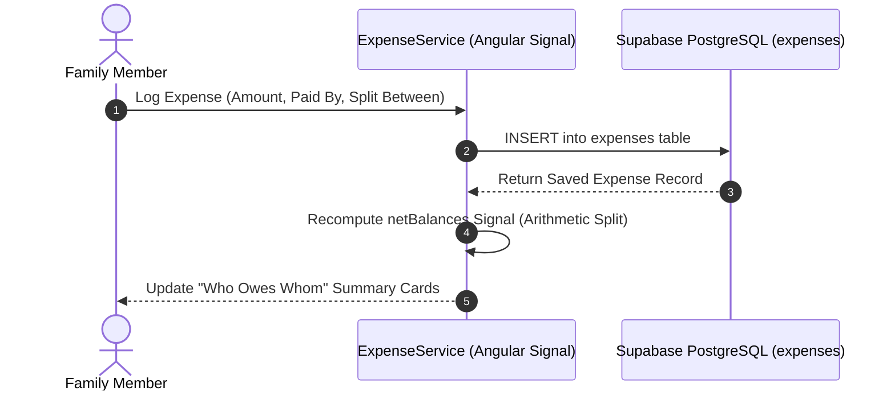
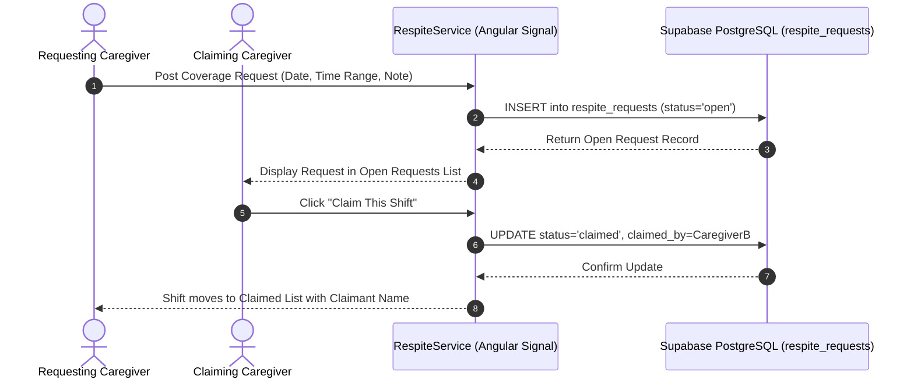
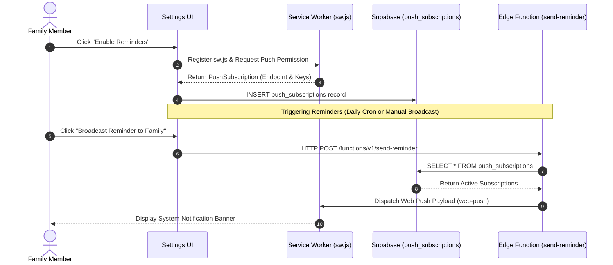

# Rafeeq Care MVP - System Architecture & Thought Behind Project

---

## 💭 The Thought Behind Rafeeq Care

Family caregiving is often managed under high stress, tight budgets, and fragmented communication between family members. Most existing eldercare software is either:
1. **Overly Complex Medical Systems**: Requiring clinical EHR records, compliance overhead, and paid SaaS subscriptions.
2. **Generic Chat Groups**: Leaving expense receipts, attendant contacts, and shift coverage scattered across messaging threads.

### Core Design Philosophy
- **Pragmatic & Accessible**: Built specifically for families with large tap targets, warm high-contrast colors (`canvas`, `companion`, `warmth`), and mobile-first responsive design.
- **Zero Medical Data Liability**: Intentionally excludes diagnoses, symptoms, and medical records to remain simple, safe, and privacy-first.
- **Zero Hosting Costs**: A 100% static single-page application hosted free on GitHub Pages, backed by Supabase Free Tier (Auth, Postgres RLS, and Edge Functions).
- **Graceful Zero-Config Fallbacks**: If Supabase is offline or uninitialized, local in-memory fallback signals ensure the app continues working smoothly.

---

## 🏗️ System Architecture Diagram

```mermaid
graph TD
    subgraph Client ["Client Layer (Browser & Mobile PWA)"]
        UI["Angular 18+ Standalone Components"]
        Signals["Angular Signals State Management"]
        SW["Static Service Worker (public/sw.js)"]
        Router["Hash Router (withHashLocation)"]
    end

    subgraph Hosting ["Static Hosting"]
        GHPages["GitHub Pages (gh-pages)"]
    end

    subgraph Backend ["Supabase Cloud Backend"]
        Auth["Supabase Auth (Magic Link OTP)"]
        DB[("PostgreSQL Database + RLS")]
        EdgeFunc["Edge Function (send-reminder)"]
    end

    subgraph Push ["Push Delivery"]
        FCM["FCM / Browser Push Service"]
    end

    GHPages --> UI
    UI --> Signals
    Signals --> Router
    UI --> SW
    UI -->|@supabase/supabase-js| Auth
    UI -->|@supabase/supabase-js| DB
    UI -->|HTTP POST| EdgeFunc
    EdgeFunc -->|web-push| FCM
    FCM -->|Push Event| SW
```

---

## 🔄 User & Data Flow Diagrams

### 1. Family Caregiver Authentication Flow



---

### 2. Shared Expense & Net Balance Calculation Flow



---

### 3. Respite Care Coverage & Claim Flow



---

### 4. Web Push Notification Flow



---

## 🖼️ Application Screenshots Gallery

All feature screenshots are captured and saved in [docs/screenshots/](file:///Users/parvezkhan/Projects/AntigravityProjects/Rafeeq%20Elder%20Care/docs/screenshots/).

### 1. Shared Wisdom Carousel (`/#/wisdom`)
*Home page greeting caregivers with timeless quotes across 5 traditions.*


---

### 2. Attendant Directory (`/#/attendants`)
*Directory cards for nurses, attendants, and caregivers filterable by service type and area.*


---

### 3. Shared Expense Tracker (`/#/expenses`)
*Log family care expenses with automated net balance arithmetic computing who owes whom.*


---

### 4. Respite Care Request Board (`/#/respite`)
*Coverage board displaying open shifts first and claimed shifts below.*


---

### 5. Low-Cost Diagnostic Directory (`/#/diagnostics`)
*Government, subsidized, and low-cost diagnostic center listings filterable by category.*


---

### 6. Helpline Directory (`/#/helplines`)
*Emergency contacts and eldercare hotlines filterable by scope (`national` | `international` | `local`).*


---

### 7. Private Gratitude Reflection (`/#/gratitude`)
*Private family journal cycling 6 rotating daily prompts with date-based history.*


---

### 8. Notification & Web Push Settings (`/#/settings`)
*Enable Web Push reminders, test local device notifications, or broadcast cloud reminders to family devices.*

